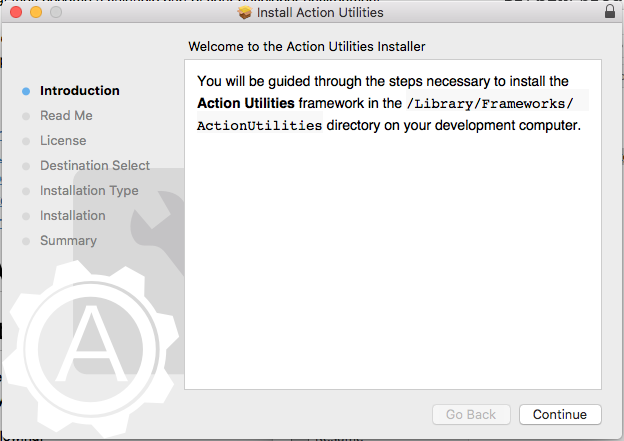
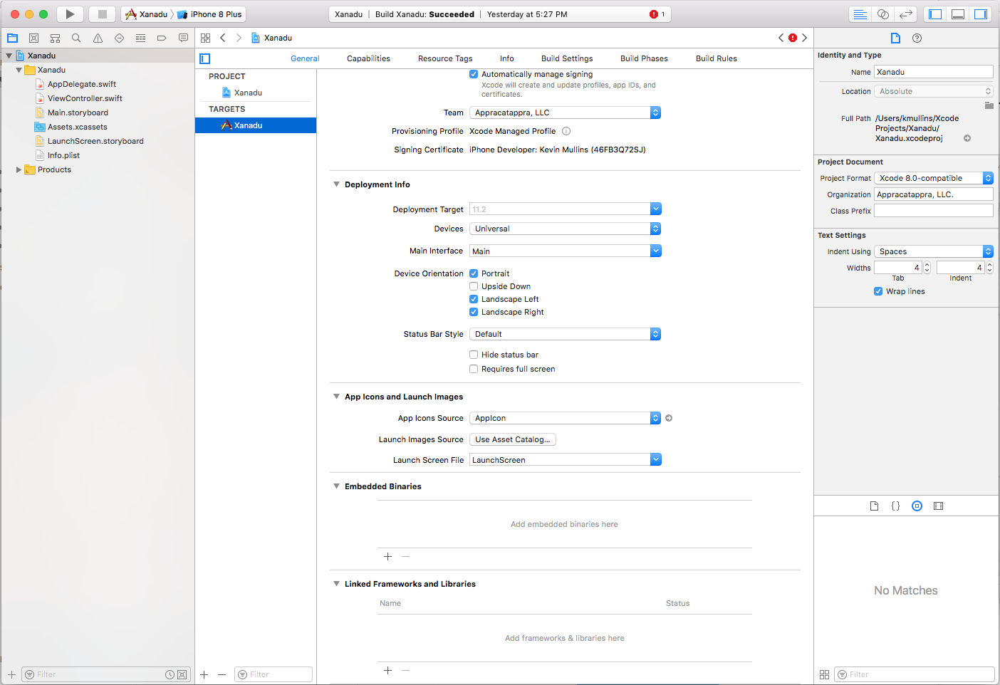
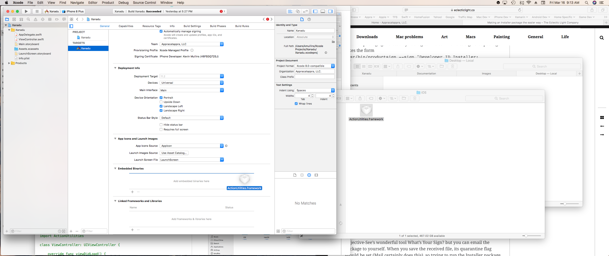
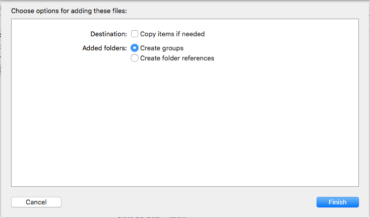

#Action Utilities Getting Started Guide

## Discover Action Utilities

Thank you for trying our [Action Utilities](http://appracatappra.com/products/action-utilities/) collection of time saving functions and utilities to solve common tasks across a wide range of mobile and desktop apps. We hope you enjoy using our components and that they become a valuable part of your developer environment. 

This guide is designed to help you get up and running with the **Action Utilities** quickly and easily in your own app projects.

The following topics are covered:

* [Installing Action Utilities](#Installing-Action-Utilities)
* [Adding Action Utilities to an App Project](#Adding-Action-Utilities-to-an-App-Project)
* [Component Documentation](#Component-Documentation)
* [Frequently Asked Questions](#Frequently-Asked-Questions)
* [Getting Support](#Getting-Support)

<a name="Installing-Action-Utilities"></a>
## Installing Action Utilities

Before you can use the **Action Utilities** suite in your Xcode Swift app projects you will need to install the framework in the `/Library/Frameworks/ActionUtilities/` directory of your development computer. Double-click the `ActionUtilitiesInstaller.pkg` file to start the installation process:



Follow and follow the on-screen instruction to complete the install. 

<a name="Adding-Action-Utilities-to-an-App-Project"></a>
## Adding Action Utilities to an App Project

Our components were designed to be quickly added to your app's project with a minimum of code, making it easy to add high-quality, professional features and functionality to your apps.

In **Xcode**, do the following:

1. Open an app project or start a new one.
2. Select the **Project** in the **Project Navigator**, select the **General** tab and scroll down to the **Embedded Binaries** section:

	
3. In **Finder**, navigate to the `/Library/Frameworks/ActionUtilities/` directory :

	
4. Open the folder that matches the type of app that you are building (for example, `iOS` for an iOS app project) and drag the framework into the **Embedded Binaries** section in **Xcode**:

	
5. You can either choose to use the framework from its default location or copy it into your app's project (by selecting **Copy items if needed**). Click the **Finish** button to complete the install:

	
7. The framework will be added to both the **Embedded Binaries** and the **Linked Frameworks and Libraries** sections:

	

You are now ready to use the **Action Utilities** suite in your app project. Include the `import ActionUtilities` statement at the top of any class you want use a component from. For example:

```swift
import UIKit
import ActionUtilities

class ViewController: UIViewController {

    override func viewDidLoad() {
        super.viewDidLoad()
        // Do any additional setup after loading the view, typically from a nib.
        let colorHex = UIColor.white.toHex()
        print(colorHex)
    }

    override func didReceiveMemoryWarning() {
        super.didReceiveMemoryWarning()
        // Dispose of any resources that can be recreated.
    }


}
```


<a name="Component-Documentation"></a>
## Component Documentation

The [Action Utilities Developer Center](http://appracatappra.com/developers/action-utilities-help/) was designed to help you get the most out of our developer tools by providing a selection of Articles, Guides, Samples and Quick Start References for each component in the suite.

Additionally, each tool in the **Action Utilities Suite** has a fully documented API, with comments for every element included:

* [iOS API Documentation](http://appracatappra.com/api/actionutilities/ios/)
* [tvOS API Documentation](http://appracatappra.com/api/actionutilities/tvos/)
* [watchOS API Documentation](http://appracatappra.com/api/actionutilities/watchos/)
* [macOS API Documentation](http://appracatappra.com/api/actionutilities/macos/)

<a name="Frequently-Asked-Questions"></a>
## Frequently Asked Questions

The following is a list of frequently asked **Action Utilities** questions:

* **Can I use Action Utilities on multiple projects?**

	Yes, you are free to use our controls on as many apps as you like. We do not place any restrictions on how many times you can download or use the components, nor do we limit the number of devices that you can install our components on.
* **Are Action Utilities royalty free?**

	Yes, you are free to use our controls in any app project, even those for your customers if you develop apps for other companies, without royalties.
* **Can I install Action Utilities on multiple development machines?**

	Yes, you can install your copy of **Action Utilities** on as many development machines that you own. 

<a name="Getting-Support"></a>
## Getting Support

Have a question about using one of our products, need to report or check on the status of a bug or need help implementing a tool in your app project? 

For faster support, answers to know issues and to get help from other users try the [Appracatappra Support Forums](http://appracatappra.com/community/).

Additionally, you can fill out our [Support Form](http://appracatappra.com/support/) and you’ll hear from a representative typically within one business day.